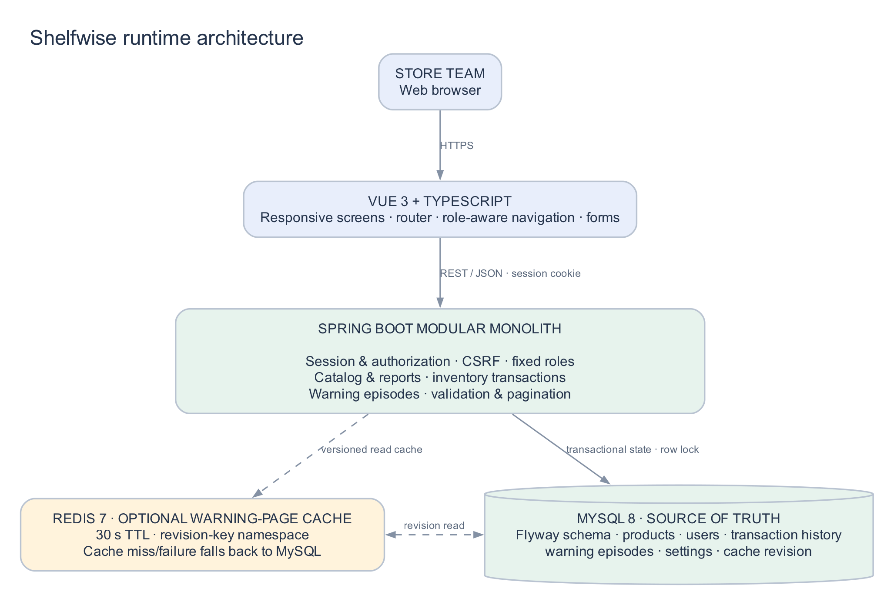

# Architecture and implementation decisions

Shelfwise is a single-process modular monolith with a Vue 3 client, Spring Boot JSON API, and MySQL system of record. The user session is a servlet session on one host; roles are reloaded from MySQL on every request so disabling an account or changing a role takes effect immediately. `XSRF-TOKEN` and `JSESSIONID` cookies are host-only; unsafe methods require the matching CSRF header. Production must terminate HTTPS and set `SESSION_COOKIE_SECURE=true`.

Product quantity is not a writable catalog field. Every receive, dispatch, signed correction, or stocktake runs in a database transaction, locks the relevant product row (`PESSIMISTIC_WRITE`), checks bounds, writes the before/delta/after audit row and reason, and recalculates warning episodes before commit. Stock count input is an absolute observed amount; the stored delta is derived while holding the lock. Each authenticated actor supplies an idempotency key; a replay with equal normalized content returns its original movement. Reusing the key for different content returns 409. A repeated request is checked after acquiring its product lock to serialize the ordinary same-product retry path.

Warning state is a persisted episode separate from acknowledgement. OUT means quantity zero; LOW means positive quantity at or below the reorder threshold; healthy stock resolves an open shortage and creates a 24-hour RESTOCKED episode. Severity change closes the previous episode. Replenishment within one episode preserves its review attribution. Threshold updates reevaluate status. Acknowledgement adds reviewer and timestamp and never mutates inventory.

MySQL retains all durable application state. Redis is an optional, 30-second cache for warning pages. Keys include a monotonic `cache_revision` from MySQL. The revision increments in the same transaction as stock/threshold changes. Consequently a cache miss/read after a commit cannot address a pre-commit page, including when a writer races a slow cache fill. Cache errors fall back to MySQL; Redis is not used for user sessions or write correctness. The benchmark can bypass caching with `GET /api/warnings?cache=false`.

Useful indexes are SKU/barcode uniqueness, product name/category/quantity, transaction `(product_id, created_at)`, warning `(state, created_at)`, and the actor/key idempotency constraint. Product filtering uses allow-listed stable sorting and pages capped at 100. A single-store currency preference changes the display code only; values do not convert. There is no accounting cost model, demand forecast, payment flow or multi-store isolation.

The source is editable at `thesis/figures/architecture.dot`. See the data relationships in [`thesis/figures/erd.png`](../thesis/figures/erd.png) and the movement workflow in [`thesis/figures/stock-workflow.png`](../thesis/figures/stock-workflow.png).
